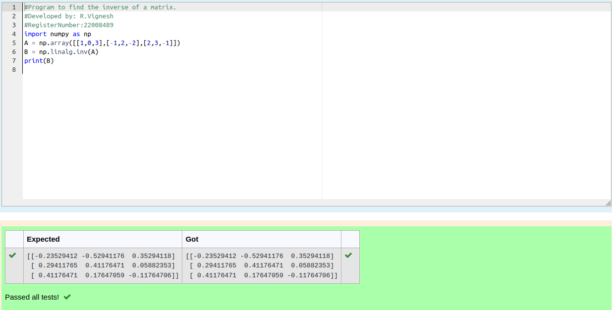

# INVERSE-OF-A-MATRIX
## Aim:
To write a python program to find the inverse of a matrix
## Equipment’s required:
1. 	Hardware – PCs
2. 	Anaconda – Python 3.7 Installation / Moodle-Code Runner
## Algorithm:
### Step1 : #Program to find the inverse of a matrix.
### Step 2: import numpy as np
### Step 3: Using the np.linalg.inv(A), we can find the inverse of the given matrix.
### Step 4: print the result
## Program:
#Program to find the inverse of a matrix.
#Developed by: R.Vignesh
#RegisterNumber:22008489
import numpy as np
A = np.array([[1,0,3],[-1,2,-2],[2,3,-1]])
B = np.linalg.inv(A)
print(B)
## Output:

## Result:
Thus the inverse of given matrix is successfully solved using python program

